# Stratos — Data Model (PostgreSQL / JSONB)

Stratos persists everything in a single PostgreSQL database, reached through
`internal/pgdoc` — a thin document store over JSONB. Each former document
"collection" is now its own **table with exactly two columns**:

```sql
create table "<name>" (id text primary key, doc jsonb not null)
```

The table names are the old collection names verbatim (they carry camelCase, so
SQL always double-quotes them: `"organization_members"`, `"cloudResource"`). The
whole document lives in the `doc` jsonb column; the primary key lives in the
separate `id` text column. There are ~48 such document tables spanning
identity/tenancy, billing, payments, pricing, the cloud resource cache, and
platform configuration. This document is the schema reference: the core
entity-relationship diagram, per-table field notes for the major tables, and a
reference table for the long-tail.

The stored JSON is produced from the Go structs via their `json:` tags
(`encoding/json`). Fields below are taken from those structs and, where a table
stores a free-form document with no dedicated struct, from the keys the code
actually reads and writes (marked **runtime doc, schema inferred from usage**).
See [architecture.md](architecture.md) for how these tables are wired into
services and jobs.

---

## Data conventions

These hold across the schema; individual tables note only their departures.

- **Primary ids are 24-char hex strings, held in the `id` column.** They are
  generated app-side by `pgdoc.NewID()`: 4 time bytes (unix seconds,
  big-endian) + 5 per-process random bytes + 3 counter bytes, hex-encoded.
  Because they are time-prefixed and counter-tailed, lexicographic id order ≈
  insertion order — which keyset (marker) paging and recency sorts rely on. Ids
  are plain 24-char hex strings end to end — there is no separate binary id type
  and no id-vs-hex-string dual keying. Structs declare
  `ID string \`json:"id,omitempty"\``, but the id is **not** stored inside `doc`
  — it lives in the `id` column and is injected back (as both `id` and `_id`,
  for struct and free-form readers) on read. A filter
  on `_id`/`id` (or `{"_id": {"$in": …}}`) is rewritten to address the `id` column
  directly; cross-table references (`organizationId`, `billingProfileId`,
  `projectId`, `serviceId`, …) store that same hex string inside `doc`.
- **A few tables key on a meaningful string id** instead of a generated one:
  `adminPermission.id` is the user's `sub` (or email while pending),
  `hmac_keys.id` is the `pk…` access-key id, `shedLock.id` is the lock name,
  `cloudDownload.id` is the **hash** of the download token, and some `pricePlan`
  ids are config slugs.
- **Internal ids vs. external cloud ids.** Fields named `externalId` /
  `externalProjectId` hold **OpenStack** ids (server id, tenant id), *not*
  Stratos ids. Everything else (`projectId`, `userId`, `serviceId`, …) is an
  internal id. The cloud cache deliberately keeps both so it can map an incoming
  OpenStack notification back to a Stratos project.
- **Foreign keys are application-level.** The tables carry no `references`
  constraints — every table is just `(id text primary key, doc jsonb)`, so
  Postgres enforces no referential integrity. The "FK" relationships below are
  id references the services join in code: a few via hand-written `LEFT JOIN` on
  `doc->>'…'`, most via a second lookup by id.
- **Embedded vs. referenced is a per-aggregate choice.** Project memberships and
  attached cloud services are **embedded** as JSON arrays inside the `project`
  document's `doc`, and a `bill`'s line items + applied credits are **embedded**
  inside the bill. Organization membership, by contrast, is a **separate**
  `organization_members` table. Expect this asymmetry.
- **Money is `decimal.Decimal`, stored as a JSON string (`"12.34"`).**
  `shopspring/decimal` (de)serializes as a decimal string, which Postgres keeps
  at full precision in `jsonb` and never as a float. Monetary fields are often a
  pointer (so "unset" is distinguishable from "zero"). Filters that compare money
  cast `(doc->>'f')::numeric`.
- **Timestamps are stored as RFC3339 strings (`"2026-07-06T09:14:56.44Z"`).**
  `time.Time` / `*time.Time` serialize via `encoding/json`; `omitempty` omits nil
  pointers. Most tables carry `createdAt` / `updatedAt`; some stamp `createdAt`
  immutably on insert (e.g. `cloudResource`). Range filters cast
  `(doc->>'f')::timestamptz`; expression indexes use the IMMUTABLE `pgdoc_ts()`
  wrapper (a bare `::timestamptz` cast is not immutable, so cannot be indexed).
- **null-vs-absent is preserved via `omitempty`** — the "drop null fields"
  parity rule still holds. A partial update that clears a field emits a jsonb
  key-removal (`-` for a top-level key, `#-` for a dotted path) — the `$unset`
  equivalent — so the key is *removed*, not set to JSON `null`. A `{f: nil}`
  filter matches "absent or JSON null".
- **NON_NULL serialization.** DTOs omit null fields but keep non-null *empty*
  collections (`memberships:[]`, `customInfo:{}`), so the wire shape is stable.
- **Secrets.** `externalService.secret` (OpenStack admin credentials) is
  encrypted at rest and decrypted in memory on read; `hmac_keys.secretKey` is
  stored as-is; `cloudDownload` stores only the hash of its token (the raw token
  is returned once and never persisted).
- **Indexes are Postgres expression indexes** over the jsonb, created
  idempotently at startup by each repo's `EnsureIndexes` (via
  `Store.EnsureIndex` → `create index if not exists … on "<table>"
  ((doc->>'field')…)`). Hot query paths are backed this way — e.g.
  `(doc->>'sub')` unique on `users`, `(doc->>'organizationId')` on
  `organization_members`, and compound expression indexes like
  `(organizationId, sub)`. Uniqueness is enforced by **unique** expression
  indexes; a duplicate raises SQLSTATE 23505, which `pgdoc.IsDup` detects (the
  get-or-create races branch on it). A missing table auto-creates on first write.
- **Atomicity via transactions (pgx).** The old single-document
  `FindOneAndUpdate` / optimistic-concurrency patterns are replaced by
  `DB.WithTx` + row locks: `GetForUpdate` / `FindOneForUpdate` issue
  `SELECT … FOR UPDATE`, and every `Store` call made with the transaction's ctx
  runs on that transaction. The cloud-cache upsert/OCC and the bill lock (claim
  the current OPEN bill, push its `lockedAt`, return the pre-image) run inside
  `WithTx`.

### Filter operator subset

Repos query with the same `M{"field": value}` / `M{"field": {"$op": value}}`
shape as before; `pgdoc.translateFilter` renders it to a SQL boolean over
`(id, doc)`. The supported operators are `$eq` (implicit), `$ne`, `$in`, `$nin`,
`$exists`, `$gt`, `$gte`, `$lt`, `$lte`, `$or`, `$and`, `$regex`, and
`$contains` / `$elemMatch`. Dotted paths address nested objects
(`doc#>>'{a,b}'`), and `_id` addresses the `id` column. Array-of-object
membership uses jsonb `@>` containment (`$contains` / `$elemMatch`) — an
explicit opt-in, since scalar equality does not implicitly match array
elements. Anything outside this subset is hand-written SQL: the **three former
aggregation pipelines** are now plain queries — a `GROUP BY doc->>'type'` (and a
`(type, serviceId)` group for the adjusted counts) for the cloud per-type
resource counts, and a `LEFT JOIN "billingProfile" b ON b.id =
c.doc->>'billingProfileId'` for the savings-contract ↔ billing-profile lookup.
The distributed job lock is likewise raw SQL (see `shedLock`, below).

### Seeded config vs. runtime tables

| Kind | Tables |
|---|---|
| **Seeded / operator-configured** (define how the platform behaves) | `platformConfiguration`, `billingConfiguration`, `pricePlan`, `pricePlanRule`, `priceAdjustmentRule`, `taxRate`, `savingsPlan`, `flavorCategory`, `imageGroup`, `imageCategory`, `instanceMetadataOption`, `messageTemplate` (system templates seeded at startup), `thirdPartyIntegration`, `customMenuItem`, `promotionCode`, `adminRole`, `roleDefinition`, `adminPermission`, `externalService` |
| **Runtime** (produced by customer + system activity) | `users`, `organization`, `organization_members`, `project`, `billingProfile`, `bill`, `accountCredit`, `accountCreditTransaction`, `collectTransaction`, `creditCard`, `creditCardTransaction`, `bankTransfer`, `promotionalCredit`, `promotionCodeRedemption`, `savingsContract`, `suspension`, `identityValidation`, `projectInvite`, `order`, `affiliateEntry`, `reminderNotification`, `builtInInvoice`, `cloudResource`, `cloudResourceHistory`, `cloudDownload`, `gnocchiMetrics`, `auditEvent`, `externalResourceProvider`, `hmac_keys`, `shedLock` |

---

## Core ERD

The core is the tenancy spine (user → organization → project), the billing hub
(`billingProfile` and everything that hangs off it), the pricing catalog, and the
cloud cache. Long-tail tables are in the [reference table](#reference-table-long-tail-tables).

Every box below is one jsonb document table, keyed by the `id` column (shown as
`PK`). The edges are **application-level id references** the services resolve in
code — there are no database foreign keys. `PK`/`FK`/`UK` here describe intent,
not enforced constraints (the one exception is `_id` uniqueness, which is the
`id` primary key, and the handful of `UK` fields backed by unique expression
indexes).

```mermaid
erDiagram
    users ||--o{ organization_members : "sub"
    organization ||--o{ organization_members : "members"
    organization ||--o{ project : "owns"
    organization }o--|| billingProfile : "billingProfileId"
    project }o--o| billingProfile : "billingProfileId"

    billingProfile ||--o{ bill : "billingProfileId"
    billingProfile ||--o{ accountCredit : "billingProfileId"
    billingProfile ||--o{ accountCreditTransaction : "billingProfileId"
    billingProfile ||--o{ collectTransaction : "billingProfileId"
    billingProfile ||--o{ creditCard : "billingProfileId"
    billingProfile ||--o{ promotionalCredit : "billingProfileId"
    billingProfile ||--o{ suspension : "billingProfileId"
    billingProfile ||--o{ savingsContract : "billingProfileId"
    billingProfile |o--o| identityValidation : "identityValidationId"

    bill ||--o{ collectTransaction : "billId"
    creditCard ||--o{ collectTransaction : "creditCardId"

    pricePlan ||--o{ pricePlanRule : "pricePlanId"
    pricePlan ||--o{ priceAdjustmentRule : "pricePlanId"
    savingsPlan ||--o{ savingsContract : "savingsPlanId"

    promotionCode ||--o{ promotionCodeRedemption : "promotionCodeId"

    project ||--o{ cloudResource : "projectId"
    externalService ||--o{ cloudResource : "serviceId"
    cloudResource ||--o{ gnocchiMetrics : "resourceId"

    users {
        string _id PK "id column"
        string sub UK "OIDC subject; principal key"
        string email
        string firstName
        string lastName
    }
    organization {
        string _id PK
        string name
        string billingProfileId FK
    }
    organization_members {
        string _id PK
        string organizationId FK
        string sub FK "users.sub"
        array roles "effective role = roles[0]"
    }
    project {
        string _id PK
        string name
        string status "ENABLED|DISABLED|SCHEDULED_FOR_DELETION|DELETE_IN_PROGRESS"
        string organizationId FK
        string billingProfileId FK
        array memberships "embedded {sub, role}"
        array services "embedded {serviceId, externalProjectId, region}"
    }
    billingProfile {
        string _id PK
        string organizationId FK
        string status "NEW|ACTIVE|SUSPENDED|SKIP"
        string currency
        string country
        string defaultCardId FK "creditCard"
        string identityValidationId FK
    }
    bill {
        string _id PK
        string billingProfileId FK
        string status "OPEN|SENT|PAID"
        array items "embedded line items"
        object billingCycle "startDate, endDate"
    }
    accountCredit {
        string _id PK
        string billingProfileId FK
        decimal amount "live spendable balance"
        string currency
    }
    accountCreditTransaction {
        string _id PK
        string billingProfileId FK
        string billId FK "nullable"
        string status "PENDING|SUCCESS|FAILED|CANCELLED"
        decimal amount
    }
    collectTransaction {
        string _id PK
        string billingProfileId FK
        string billId FK
        string creditCardId FK
        string status "PENDING|SUCCESS|FAILED|CANCELLED"
        decimal amount
    }
    creditCard {
        string _id PK
        string billingProfileId FK
        string tokenId "gateway payment-method id"
        string panMasked
        time tokenExpirationDate
    }
    promotionalCredit {
        string _id PK
        string billingProfileId FK
        string code "redeemed code value"
        decimal remainingAmount
        time expirationDate
    }
    suspension {
        string _id PK
        string billingProfileId FK
        string status "IN_PROGRESS|SUSPENDED|RESOLVED"
        array notifications
    }
    savingsPlan {
        string _id PK
        string name
        bool available
        array savingSchedule
    }
    savingsContract {
        string _id PK
        string billingProfileId FK
        string savingsPlanId FK
        string status "ACTIVE|EXPIRED|CANCELLED"
        int durationMonths
    }
    pricePlan {
        string _id PK
        string name
        bool enabled
        string accessMode "PUBLIC|SCOPED"
    }
    pricePlanRule {
        string _id PK
        string pricePlanId FK
        string resourceType
        string timeUnit
        array prices "tiered attribute prices"
    }
    priceAdjustmentRule {
        string _id PK
        string pricePlanId FK
        bool enabled
        array tiers
    }
    promotionCode {
        string _id PK
        string code
        decimal amount
        string status "ACTIVE|DISABLED"
    }
    promotionCodeRedemption {
        string promotionCodeId FK
        string organizationId FK
        string billingProfileId FK
    }
    externalService {
        string _id PK
        string name
        string type "CLOUD|CPANEL|PAYMENT"
        string status "PUBLIC|PRIVATE|DISABLED"
        object secret "encrypted OpenStack creds"
    }
    cloudResource {
        string _id PK
        string projectId FK
        string serviceId FK
        string externalId "OpenStack resource id"
        string type "SERVER|VOLUME|PORT|..."
        object data "type-specific"
    }
    gnocchiMetrics {
        string _id PK
        string resourceId FK "cloudResource._id"
        object billingCycle
        object details "traffic MB"
    }
    identityValidation {
        string _id PK
        string billingProfileId FK
        string sub FK "users.sub"
        string status "PENDING|APPROVED|REJECTED"
    }
```



---

## Identity & tenancy

### `users`
The tenant principal, keyed by OIDC `sub`; a row is created on first user-init
(get-or-create by `sub`).

| Field | Type | Meaning |
|---|---|---|
| `_id` | string | 24-char hex id (`id` column) |
| `sub` | string | OIDC subject; principal key (unique expression index on `doc->>'sub'`) |
| `email`, `firstName`, `lastName` | string | profile |
| `emailConfirmedAt` | time | email confirmation time |
| `identities` | array | federated identities, each `{sub, issuer, claims}` |
| `consent`, `tags` | array | consent records / labels |
| `customInfo`, `metadata` | object | free-form |

Referenced by `sub` from `organization_members`, `project.memberships[]`,
`project.owner`, `identityValidation`, `adminPermission`, and audit actors.

### `organization`
A customer tenant. Points at exactly one billing profile.

| Field | Type | Meaning |
|---|---|---|
| `_id` | string | hex id |
| `name`, `description` | string | |
| `billingProfileId` | string FK → `billingProfile` | the org's billing profile |
| `customInfo` | object | free-form |

### `organization_members`
The user↔organization join with roles. A separate table (unique compound
expression index on `organizationId + sub`, plus a `sub` index for
membership-by-user lookups).

| Field | Type | Meaning |
|---|---|---|
| `_id` | string | hex id |
| `organizationId` | string FK → `organization` | |
| `sub` | string FK → `users.sub` | member |
| `roles` | array&lt;string&gt; | role names; **effective role = `roles[0]`** — built-in `OWNER`/`ADMIN`/`MEMBER` or a custom `roleDefinition` name |

### `project`
A workspace inside an organization; the unit cloud resources attach to.
Memberships and attached services are **embedded** JSON arrays.

| Field | Type | Meaning |
|---|---|---|
| `_id` | string | hex id |
| `name`, `status` | string | status ∈ `ENABLED`/`DISABLED`/`SCHEDULED_FOR_DELETION`/`DELETE_IN_PROGRESS` |
| `organizationId` | string FK → `organization` | |
| `billingProfileId` | string FK → `billingProfile` | optional direct link (usually inherited via the org) |
| `owner` | string FK → `users.sub` | deprecated but still stored |
| `memberships` | array | embedded `{sub, role}` (role `OWNER`/`MEMBER`) |
| `services` | array | embedded attached-service docs `{serviceId → externalService, externalProjectId (OpenStack tenant id), region, pricePlanId}` |
| `scheduledForDeletionAt` | time | deletion grace timer |

### `projectInvite`
A pending invitation to a project. **Runtime doc** (no struct). Carries an
`expiresAt` timestamp expression index; because Postgres has no TTL index, expiry
is enforced app-side — a `DeleteMany({expiresAt: {$lt: now}})` purges stale rows
on lookup, and each invite is `+24h`.

| Field | Type | Meaning |
|---|---|---|
| `email` | string FK → `users.email` | invitee; query key |
| `projectId` | string FK → `project` | |
| `token` | string | lookup token (UUID) |
| `expiresAt` | time | expiry (lazy-purged) |

---

## Billing

### `billingProfile`
The billing hub — the identity a bill is issued to and the anchor almost every
financial table references. Rich address/tax/company fields plus embedded config
sub-docs.

| Field | Type | Meaning |
|---|---|---|
| `_id` | string | hex id |
| `organizationId` | string FK → `organization` | owning org |
| `status` | string | `NEW` / `ACTIVE` / `SUSPENDED` / `SKIP` |
| `email`, `firstName`, `lastName`, `phone` | string | contact |
| `currency` | string | billing currency |
| `company`, `companyName`, `vatCode`, `taxPayer` | bool/string | tax identity |
| `address`, `city`, `county`, `country`, `zipCode` | string | billing address |
| `defaultCardId` | string FK → `creditCard` | default payment card |
| `identityValidationId` | string FK → `identityValidation` | KYC record |
| `projectProvisioningQuota` | object | `{enabled, limit}` project cap |
| `suspensionConfiguration` | object | auto-suspension policy (balance/due-date) |
| `pricePlanConfig` | object | `{pricePlanIds[] → pricePlan, includePublicPricePlans}` |
| `activationConstraints` | array | passed activation gates `{source, passedAt}` |
| `activatedAt` | time | activation time |

### `bill`
A billing-cycle invoice for a profile. Line items and applied credits are
**embedded**. Claimed under a row lock (`FindOneForUpdate` inside `WithTx`) so a
cron worker can push its `lockedAt` lease atomically.

| Field | Type | Meaning |
|---|---|---|
| `_id` | string | hex id |
| `billingProfileId` | string FK → `billingProfile` | |
| `status` | string | `OPEN` → `SENT` → `PAID` |
| `invoiceCurrency` | string | |
| `billingCycle` | object | `{startDate, endDate}` |
| `items` | array | embedded `BillItem`s (per resource: `resourceId`, `projectId`, `resourceType`, `netAmount`, `timeUnits`, `appliedPricePlanRules[] → pricePlanRule`) |
| `adjustments` | array | savings-contract / price-adjustment deductions (carry `contractId → savingsContract`, `priceAdjustmentRuleId → priceAdjustmentRule`) |
| `appliedAccountCredits` | array | `accountCreditId → accountCredit` applications |
| `appliedPromotionalCredits` | array | `promotionalCreditId → promotionalCredit` |
| `collectedAmounts` | array | `collectTransactionId → collectTransaction` |
| `dueAt`, `sentAt`, `lockedAt` | time | lifecycle timestamps (`lockedAt` is the lease compare key) |

### `accountCredit`
A spendable prepaid-balance document (a deposit becomes credit).

| Field | Type | Meaning |
|---|---|---|
| `_id` | string | hex id |
| `billingProfileId` | string FK → `billingProfile` | |
| `initialAmount`, `amount` | decimal | original / live remaining balance |
| `currency` | string | |
| `invoiceSeries`, `invoiceNumber`, `invoiceCurrency`, `invoiceExchangeRate` | string/decimal | invoice metadata |

### `accountCreditTransaction`
The deposit / add-funds ledger — each attempt to top up a balance (via card,
bank transfer, or admin).

| Field | Type | Meaning |
|---|---|---|
| `_id` | string | hex id |
| `billingProfileId` | string FK → `billingProfile` | |
| `billId` | string FK → `bill` | when the deposit targets a bill |
| `orderId` | string FK → `order` | originating order |
| `externalId` | string | gateway payment-intent / bank-transfer id |
| `status` | string | `PENDING` / `SUCCESS` / `FAILED` / `CANCELLED` |
| `amount`, `grossAmount`, `exchangeRate` | decimal | |
| `paymentGatewayId`, `invoiceGatewayId` | string FK → `thirdPartyIntegration` | |
| `accountCredit` | object | embedded snapshot of the credit it created |
| `metadata` | object | e.g. `savingsContractId`, `saveCardForFutureUse` |

### `promotionalCredit`
Credit minted by redeeming a promotion code; drawn down as bills apply it.

| Field | Type | Meaning |
|---|---|---|
| `_id` | string | hex id |
| `billingProfileId` | string FK → `billingProfile` | |
| `code` | string | the redeemed `promotionCode.code` **value** (not its id) |
| `initialAmount`, `remainingAmount` | decimal | granted / live balance |
| `expirationDate` | time | sentinel `9999-01-01` means never expires |

### `suspension`
The auto-suspension state machine for a profile (dunning).

| Field | Type | Meaning |
|---|---|---|
| `_id` | string | hex id |
| `billingProfileId` | string FK → `billingProfile` | |
| `status` | string | `IN_PROGRESS` / `SUSPENDED` / `RESOLVED` |
| `notifications` | array | dunning notices sent `{suspensionLimit, balance, sentAt}` |

### `savingsPlan` & `savingsContract`
`savingsPlan` is the catalog offer (commitment tiers, targets); `savingsContract`
is a profile's active commitment against a plan. The admin "contracts for a plan,
with their profile" listing is served by a hand-written `LEFT JOIN` from
`savingsContract` onto `billingProfile` (see the aggregation note above).

**savingsPlan**

| Field | Type | Meaning |
|---|---|---|
| `_id` | string | hex id |
| `name`, `description`, `available` | string/bool | |
| `targets` | array | `{resourceType, filters}` covered resources |
| `savingSchedule` | array | duration/amount tiers (`durationMonths`, upfront/no-upfront tiers) |
| `billingProfiles` | array | scoping `{billingProfileId}` |

**savingsContract**

| Field | Type | Meaning |
|---|---|---|
| `_id` | string | hex id |
| `billingProfileId` | string FK → `billingProfile` | |
| `savingsPlanId` | string FK → `savingsPlan` | |
| `status` | string | `ACTIVE` / `EXPIRED` / `CANCELLED` |
| `durationMonths`, `startDate`, `endDate` | int/time | term |
| `discountRate`, `monthlyCommittedAmount` | decimal | |
| `paidUpfront` | bool | |
| `orderId` | string FK → `order` | purchasing order |

### `identityValidation`
A KYC/identity record for a profile (defined in the billing domain).

| Field | Type | Meaning |
|---|---|---|
| `_id` | string | hex id |
| `billingProfileId` | string FK → `billingProfile` | |
| `sub` | string FK → `users.sub` | |
| `country`, `status` | string | status `PENDING` / `APPROVED` / `REJECTED` |

---

## Payments

### `creditCard`
A saved payment method (gateway token, never raw PAN).

| Field | Type | Meaning |
|---|---|---|
| `_id` | string | hex id |
| `billingProfileId` | string FK → `billingProfile` | |
| `tokenId` | string | gateway payment-method id (`pm_…`) |
| `panMasked` | string | masked card number |
| `tokenExpirationDate` | time | validity (no explicit status field) |
| `paymentGatewayId` | string FK → `thirdPartyIntegration` | |
| `metadata` | object | always stored (even empty `{}`) |

### `creditCardTransaction`
Card-registration (setup-intent) attempts.

| Field | Type | Meaning |
|---|---|---|
| `_id` | string | hex id |
| `billingProfileId` | string FK → `billingProfile` | |
| `externalId` | string | gateway SetupIntent id |
| `status`, `errorMessage` | string | |
| `amount`, `exchangeRate` | decimal | |
| `paymentGatewayId`, `invoiceGatewayId` | string FK → `thirdPartyIntegration` | |

### `collectTransaction`
A charge that **collects** an outstanding bill from a saved card.

| Field | Type | Meaning |
|---|---|---|
| `_id` | string | hex id |
| `billingProfileId` | string FK → `billingProfile` | |
| `billId` | string FK → `bill` | bill being collected |
| `creditCardId` | string FK → `creditCard` | card charged |
| `orderId` | string FK → `order` | |
| `externalId` | string | gateway payment id |
| `status` | string | `PENDING` / `SUCCESS` / `FAILED` / `CANCELLED` |
| `amount`, `grossAmount`, `exchangeRate` | decimal | |
| `paymentGatewayId`, `invoiceGatewayId` | string FK → `thirdPartyIntegration` | |

### `bankTransfer`
A manual bank-transfer deposit awaiting operator approval. **Runtime doc** (no
struct).

| Field | Type | Meaning |
|---|---|---|
| `status` | string | `PENDING` → `APPROVED` / `REJECTED` |
| `accountCreditTransactionId` | string FK → `accountCreditTransaction` | the deposit txn (lookup key) |
| `billingProfileId` | string FK → `billingProfile` | |
| `paymentGatewayId` | string FK → `thirdPartyIntegration` | |
| `referenceNumber` | int | transfer reference |
| `fullName`, `grossAmount`, `currency`, `comments` | string/decimal | |

---

## Pricing

### `pricePlan`
A plan of rating rules, scoped to service providers.

| Field | Type | Meaning |
|---|---|---|
| `_id` | string | hex id or config slug |
| `name`, `enabled` | string/bool | |
| `accessMode` | string | `PUBLIC` / `SCOPED` |
| `serviceProviders` | array | `{serviceId → externalService, region}` scoping |

### `pricePlanRule`
One rule under a plan: how a resource type's usage attributes become money.

| Field | Type | Meaning |
|---|---|---|
| `_id` | string | hex id |
| `pricePlanId` | string FK → `pricePlan` | |
| `name`, `resourceType`, `timeUnit` | string | rule scope + cadence |
| `applyMethod` | string | `ADD_TO_TOTAL` / `OVERWRITE_TOTAL` |
| `prices` | array | `{attributeName, tiers:[{from,to,value}]}` tiered pricing |
| `filters` | array | attribute predicates selecting matching resources |
| `modifiers` | array | attribute-derived multipliers/adders |

### `priceAdjustmentRule`
A tiered discount/surcharge applied on top of a plan.

| Field | Type | Meaning |
|---|---|---|
| `_id` | string | hex id |
| `pricePlanId` | string FK → `pricePlan` | |
| `name`, `enabled`, `description` | string/bool | |
| `targets` | array | `{resourceType, filters}` |
| `tiers` | array | `{startAmount, modifier:{operator, asPercentage, value}}` |

### `taxRate`
A tax rate table by jurisdiction and audience.

| Field | Type | Meaning |
|---|---|---|
| `_id` | string | hex id |
| `name`, `country`, `state`, `level` | string | jurisdiction; `level` audience = `BUSINESS_ONLY` / `CONSUMERS_ONLY` / `ALL` |
| `rateLevels` | array | `{level, percentage}` |
| `startDate`, `endDate` (+ `…Enabled`) | time/bool | validity window |

---

## Cloud

### `externalService`
A region's cloud (or payment/cPanel) connection. The pod's source of OpenStack
credentials; the `secret` sub-document is encrypted at rest.

| Field | Type | Meaning |
|---|---|---|
| `_id` | string | hex id |
| `name` | string | |
| `type` | string | `CLOUD` / `CPANEL` / `PAYMENT` |
| `status` | string | `PUBLIC` / `PRIVATE` / `DISABLED` |
| `defaultPricePlan` | string | default plan for the service |
| `config` | object | connection config: `identityUrl`, `provider`, `regions`, `gnocchiGranularity`, `auth:{adminUsername, adminProjectId (OpenStack), applicationCredentialId, …}` |
| `secret` | object (encrypted) | `adminPassword`, `applicationCredentialSecret` |

Referenced by `cloudResource.serviceId`, `cloudDownload.serviceId`,
`externalResourceProvider.externalServiceId`, `pricePlan.serviceProviders[]`,
`project.services[].serviceId`.

### `cloudResource`
The cache mirroring one OpenStack resource. `data` is type-specific (the `type`
discriminates its shape); `updatedAt` is the optimistic-concurrency key, and
cache upserts run under a row lock inside `WithTx`. Per-type resource counts are
served by hand-written `GROUP BY` queries over this table (not the filter DSL).

| Field | Type | Meaning |
|---|---|---|
| `_id` | string | hex id (internal cache id) |
| `projectId` | string FK → `project` | owning project (internal) |
| `serviceId` | string FK → `externalService` | source cloud |
| `externalId` | string | **OpenStack** resource id |
| `userId` | string FK → `users` | for identity-type resources |
| `type` | string | `SERVER`, `VOLUME`, `PORT`, `FLOATING_IP`, `LOAD_BALANCER`, `IMAGE`, `NETWORK`, `BUCKET`, `SHARE`, … |
| `region`, `availabilityZone` | string | placement |
| `data` | object | type-specific resource detail |
| `createdAt` | time | immutable (set on insert) |
| `updatedAt` | time | optimistic-lock compare key |

### `cloudResourceHistory`
A soft-delete archive: when a cached resource is removed, a history row is
written (idempotent per `cloudResourceID`) so recreation can be detected.

| Field | Type | Meaning |
|---|---|---|
| `_id` | string | hex id |
| `cloudResourceID` | string FK → `cloudResource` | original id (dedupe key) |
| `projectId`, `serviceId` | string FK | as on the resource |
| `externalId`, `type`, `region`, `data` | mixed | archived snapshot |
| `createdAt`, `deletedAt` | time | original create / archive time |

### `gnocchiMetrics`
Per-resource, per-cycle usage (network traffic, object-store counters) ingested
from OpenStack Gnocchi; the input the traffic-billed rating rules read.

| Field | Type | Meaning |
|---|---|---|
| `_id` | string | hex id |
| `resourceId` | string FK → `cloudResource._id` | the cached resource (internal id) |
| `resourceType` | string | |
| `billingCycle` | object | `{startDate, endDate}` (lookup key with `resourceId`) |
| `details` | object | traffic in MB (incoming/outgoing, public/private, totals) as decimal-string money |
| `ostorMetrics` | object | S3/object-store counters (bytes, puts, gets, lists) |

### `cloudDownload`
A short-lived (1h) tokenized download grant for an object-store object. The
document's `id` is the **hash** of the download token; the raw token is returned
once (for the `/api/v1/download/{token}` URL) and never stored, so a DB read
cannot reconstruct a usable token. Expiry is checked in code on lookup.

| Field | Type | Meaning |
|---|---|---|
| `_id` | string | hash of the download token (the `id` column) |
| `type` | string | `OPENSTACK_SWIFT_BUCKET` / `OPENSTACK_S3_OBJECT` |
| `serviceId` | string FK → `externalService` | |
| `projectId` | string FK → `project` | |
| `externalId` | string | OpenStack resource id |
| `metadata` | object | per-type params |
| `expiresAt` | time | now + 1h |

---

## Platform

### `platformConfiguration`
The single per-deployment config the UI bootstraps from. The active doc has
`defaultConfiguration: true`.

| Field | Type | Meaning |
|---|---|---|
| `_id` | string | hex id |
| `name`, `language` | string | |
| `branding` | object | logos, colors, favicon, theme, scripts |
| `regions` | array | `{serviceId → externalService, region, order}` display config |
| `dateConfiguration` | object | `{dateFormat}` |
| `projectProvisioningQuota` | object | `{enabled, limit}` platform-default project cap |
| `loginConfiguration` | object | login/IdP UI config |
| `mailGatewayId`, `contactIntegrationId`, `segmentIntegrationId` | string FK → `thirdPartyIntegration` | wired integrations |

### `auditEvent`
The audit log; written asynchronously after a successful mutation.

| Field | Type | Meaning |
|---|---|---|
| `_id` | string | hex id |
| `timestamp` | time | event time |
| `requestInterface` | string | `CLIENT_AREA` / `USER_ACCOUNT` / `ADMIN_AREA` / `SYSTEM_JOB` |
| `eventContext` | string | `ORGANIZATION` / `PROJECT` / `USER` / `PLATFORM` |
| `action` | string | `CREATE` / `UPDATE` / `DELETE` / … |
| `resourceType`, `resourceId`, `resourceDisplayName` | string | affected resource |
| `changes` | array | `{field, oldValue, newValue}` diffs |
| `actor` | object | `{type, id, displayName, ipAddress, userAgent}` |
| `organizationId`, `projectId` | string FK | scope |
| `outcome`, `errorMessage` | string | `SUCCESS` / `FAILURE` |
| `archived` | bool | always written |

### `order`
A provisioning/purchase order (paid via deposit or collect).

| Field | Type | Meaning |
|---|---|---|
| `_id` | string | hex id |
| `billingProfileId` | string FK → `billingProfile` | |
| `netAmount`, `taxAmount` | decimal | |
| `items` | array | `{name, type, netAmount, taxAmount, resourceId, metadata}` |
| `status` | string | `CREATED` / `PAID` |

### `adminPermission`
Grants operator (admin-console) access; the `id` is the user's `sub`.

| Field | Type | Meaning |
|---|---|---|
| `_id` | string | the user `sub` (or email while pending) — the `id` column |
| `email` | string | |
| `role` | string FK → `adminRole.name` | granted admin role (or built-in) |
| `pending` | bool | true until the invited email resolves to a `sub` |

---

## Reference table (long-tail tables)

These are documented one-line here; most are seeded config or narrow runtime
records. Those without a dedicated Go struct are **runtime docs** whose schema is
inferred from read/write usage.

| Table | Struct? | Purpose / key fields |
|---|---|---|
| `roleDefinition` | yes | Per-org custom RBAC role: `{organizationId → organization, name, permissions[]}` (unique expression index on `organizationId+name`). Referenced by `organization_members.roles[]`. |
| `adminRole` | runtime | Platform-level custom admin role: `{name, permissions[], description}`. Built-in admin roles are code, not stored. Referenced by `adminPermission.role`. |
| `billingConfiguration` | partial | Singleton billing config (active doc `defaultConfiguration:true`): `baseCurrency`, `promotionCodesEnabled`, `mailGatewayId`/`invoiceGatewayId` (→ `thirdPartyIntegration`), `suspensionConfiguration`, `autoActivationFlow`, `provisioningSettings.promotionals[]`, `settings`. |
| `thirdPartyIntegration` | partial | A configured external integration (mail/payment/invoice/CRM/live-chat): `{name, thirdParty, category, config, secret}`. Referenced by many `*GatewayId`/`*IntegrationId` fields. |
| `messageTemplate` | yes | Named email template: `{key (unique), messageTitle, messageBody (Mustache), category, systemTemplate, disabled}`. System templates seeded at startup. |
| `customMenuItem` | runtime | Client-UI custom nav item: `{displayName, url, icon, renderMode, order}`. |
| `flavorCategory` | runtime | Catalog grouping of compute flavors: `{orderNumber, enabled, …}`. |
| `imageGroup` | runtime | Catalog grouping of images: `{categoryId → imageCategory, images[], orderNumber, enabled}`. |
| `imageCategory` | runtime | Top-level image category: `{orderNumber, enabled, bareMetal}`. |
| `instanceMetadataOption` | runtime | Configurable instance-metadata field shown at create time: `{key, type, displayName, enabled, userEditable, serviceIds[] → externalService, regions[], options[], numericRange}`. |
| `externalResourceProvider` | runtime | An external resource provider bound to a cloud service: `{name, url, externalServiceId → externalService, auths:[{hmacKeyId → hmac_keys}]}`. |
| `hmac_keys` | runtime | SigV4 / provider API key pair: `{_id: "pk…" access key (the id column), secretKey: "sk…" signing secret, description, createdAt}`. Used by the Admin API and MCP api-key auth. |
| `affiliateEntry` | yes | Affiliate/referral earning row: `{billingProfileId → billingProfile, amount, originAmount}`. |
| `reminderNotification` | yes | Scheduled reminder (e.g. savings-contract expiry): `{targetResourceId → savingsContract, messageTemplateId → messageTemplate, resourceType, status, notifications:[{daysBefore, sentAt}]}`. |
| `builtInInvoice` | runtime | A generated built-in invoice record: `{invoiceGatewayId → thirdPartyIntegration, createdAt, …}`. |
| `shedLock` | (lock pkg) | Cross-fleet job lock so a scheduled job runs once across pods: `{_id: lock name (the id column), lockUntil, lockedAt, lockedBy}`. Claimed in one statement — `INSERT … ON CONFLICT (id) DO UPDATE … WHERE lockUntil ≤ now` (a live lock fails the WHERE guard → 0 rows → not acquired). |

---

## Coverage notes

- **Documented with field-level detail (32):** `users`, `organization`,
  `organization_members`, `project`, `projectInvite`, `billingProfile`, `bill`,
  `accountCredit`, `accountCreditTransaction`, `promotionalCredit`, `suspension`,
  `savingsPlan`, `savingsContract`, `identityValidation`, `creditCard`,
  `creditCardTransaction`, `collectTransaction`, `bankTransfer`, `pricePlan`,
  `pricePlanRule`, `priceAdjustmentRule`, `taxRate`, `externalService`,
  `cloudResource`, `cloudResourceHistory`, `gnocchiMetrics`, `cloudDownload`,
  `platformConfiguration`, `auditEvent`, `order`, `adminPermission`,
  `promotionCode` / `promotionCodeRedemption` (below).
- **In the reference table (16):** `roleDefinition`, `adminRole`,
  `billingConfiguration`, `thirdPartyIntegration`, `messageTemplate`,
  `customMenuItem`, `flavorCategory`, `imageGroup`, `imageCategory`,
  `instanceMetadataOption`, `externalResourceProvider`, `hmac_keys`,
  `affiliateEntry`, `reminderNotification`, `builtInInvoice`, `shedLock`.
- **Stored as runtime documents (no dedicated struct), schema inferred from
  usage:** `projectInvite`, `bankTransfer`, `promotionCode`,
  `promotionCodeRedemption`, `flavorCategory`, `imageGroup`, `imageCategory`,
  `instanceMetadataOption`, `customMenuItem`, `externalResourceProvider`,
  `hmac_keys`, `builtInInvoice`, `thirdPartyIntegration` (partial struct),
  `billingConfiguration` (partial struct). Every field listed for these is one
  the code demonstrably reads or writes.
- **`promotionCode` / `promotionCodeRedemption`** (runtime docs):
  `promotionCode` = `{code, amount, description, creditValidityDuration,
  validFrom, validUntil, targetOrganizationIds[] → organization, status}`;
  `promotionCodeRedemption` = `{promotionCodeId → promotionCode, organizationId
  → organization, billingProfileId → billingProfile, source}` (dedup on
  `promotionCodeId + organizationId`). Redemption mints a `promotionalCredit`
  carrying the code **value**.
- Every table named in the task brief was located; none required fabrication.
  `identityValidation` lives in the billing domain (the KYC package holds only
  provider seams). Mail/CRM/KYC/live-chat have no own tables — their runtime
  state is a `thirdPartyIntegration` or (for KYC) `identityValidation`.
</content>
</invoke>
